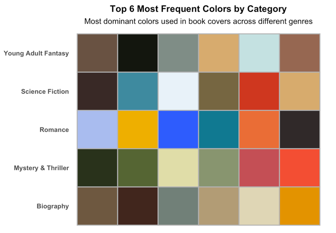
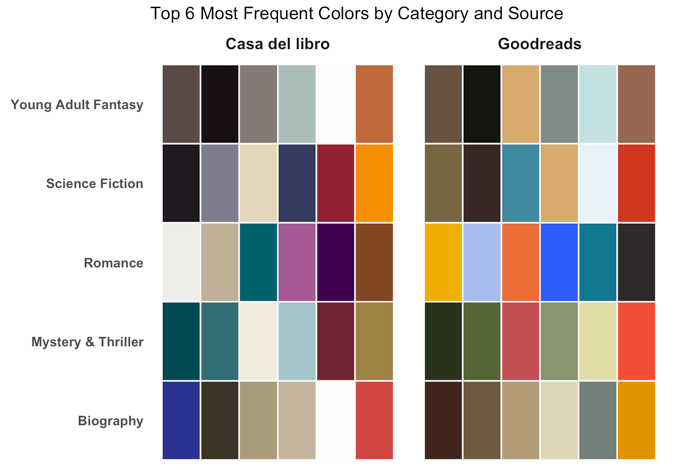
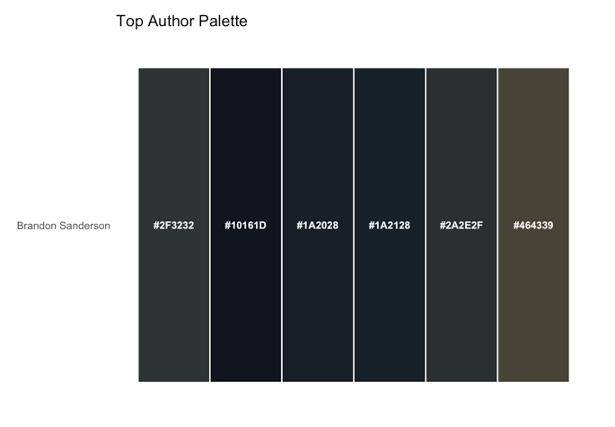
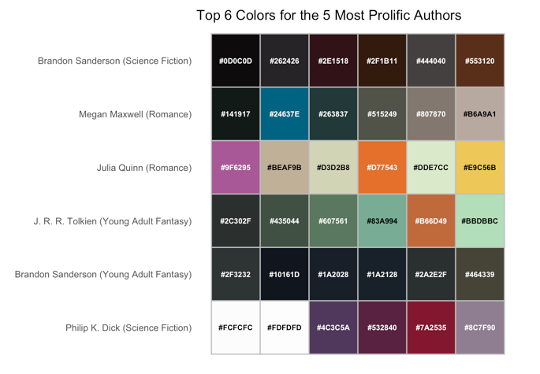

### Book cover colors

-   Crucial role in purchasing/reading decisions.
-   Objective of the study:
    -   **Analyze the color palettes of book covers across different genres**
    -   **Bestsellers vs most popular books**

::::: columns
::: {.column width="60%"}
{fig-align="center" width="361"}
:::

::: {.column width="40%"}
{width="98"}
:::
:::::

------------------------------------------------------------------------

### How?

::: {.panel-tabset}

## Tools

| Casa del Libro | GoodReads |
|--------------------------------------|------------------|
| {width="120"}{width="92"} | {width="88"} |

## Functions

-   **`scrap_books`**: scrap books from Casa del Libro
-   **`extract_colors`**: pull out color form images url
-   **`hex_to_rgb`**: convert hex colors to RGB for analysis
-   **`color clustering`**: easier identification of colors

## Results

```{r}
library(readxl)
read_xlsx("best_books_expanded.xlsx")

```

:::

------------------------------------------------------------------------

### Analysis

::: {.panel-tabset}

## Category
::: {style="text-align: center;"}

:::

## Category & web
::: {style="text-align: center;"}

:::

## Top Author
::: {style="text-align: center;"}

:::

## Top 5 authors
::: {style="text-align: center;"}

:::

:::

------------------------------------------------------------------------

### Shiny app

[App](https://mariacarda.shinyapps.io/data_harvesting_books/)

<iframe src="https://mariacarda.shinyapps.io/data_harvesting_books/" width="10000px" height="500px" style="border: none;">

</iframe>

------------------------------------------------------------------------

### Challenges

-   Selection of unique name categories in Casa del Libro

-   Same categories in both webpages

-   Docker integration/port selection

-   Last Firefox version in Selenium

-   Color representation

-   Shiny integration & publication

# Thank you {.title-slide}
